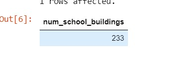
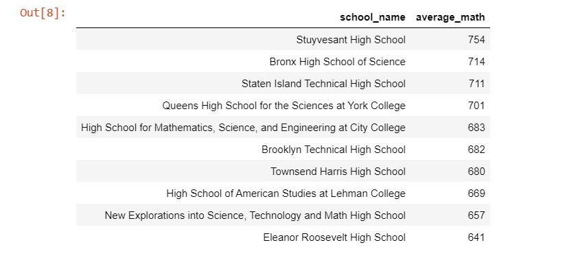
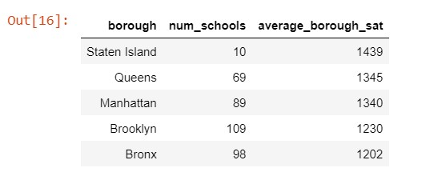
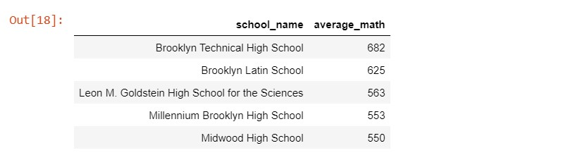

# Analyzing-NYC-Public--School-Test-Result-Scores

# Introduction
Every year, American high school students take SATs, which are standardized tests intended to measure literacy, numeracy, and writing skills. 
There are three sections - reading, math, and writing, each with a maximum score of 800 points. These tests are extremely important for students and colleges, 
as they play a pivotal role in the admissions process.
Analyzing the performance of schools is important for a variety of stakeholders, including policy and education professionals, researchers, 
government, and even parents considering which school their children should attend.

So, let's go!

# Inspecting the data
It is good practice to check the nature of the data, for example, the total number of columns, and the total number of rows. The result of the first query shows that the dataset has seven columns and three hundred and seventy-five rows. The query was written for only ten rows to be returned.
# Finding missing values
The query returned when inspecting the dataset shows that the school on the first row, "New Explorations into Science, Technology and Math High School" has no data for percentage_tested. The next thing to do is to check if any of the schools have missing data for the percentage_tested column. To understand whether this is a missing data problem that is widespread. The number of total schools in the database was calculated to the ratio of the total percent_tested. The query result showed that there are twenty schools whose percent_tested is missing which makes up for 5% of the total schools in the database.

# Schools by building code
Since there are twenty schools with missing data for the percent tested. The next step is to check for how many schools there are. While inspecting the data several had the same value in the building_code column which indicates that there are several schools in the same location. The next step is to check for how many unique schools exist in a location. Query results showed there are a unique number of two hundred and thirty-three schools. Which is only 62% of the total schools.
Moving next to the best schools in each category of the SATs

# Best schools for math
Here we start the analysis of the school's performance. As each school reports individually they would be treated as such rather than grouping them with building_code. The query result was limited to ten to focus on the best ten schools that are best for math. We are looking to find all schools with an average math score of at least 80% (out of 800, the total score). Stuyvesant High School has the highest average math score of 754. 

# Lowest reading score
Next, we look for the lowest average reading score. The query result of the lowest reading score is three hundred and two.

# Best writing school
Moving forward we look for the school with the highest average score. The query result returned Stuyvesant High School with an average score of 693.

# Top 10 schools
Stuyvesant High School has the top writing score and the top math score. Let's check what other schools are also excellent across the board. The query result shows Stuyvesant High School being the top school with a total average score of two thousand one hundred and forty-four average sat score across the board of all subjects while High School for Mathematics, Science, and Engineering at City College is at the bottom of the list with a thousand eight hundred and eighty-nine average sat score.

# Ranking boroughs
Next, is analyzing the average SAT score per borough. The query result showed that schools in Staten Island produce a higher score across the average math, average reading, and average writing.

# Brooklyn numbers
The previous query showed that schools in Staten Island produce higher scores across all three categories. However, there are only ten schools in Staten Island compared to an average of ninety-one schools in the other four boroughs. The result of the new query would focus on them.

