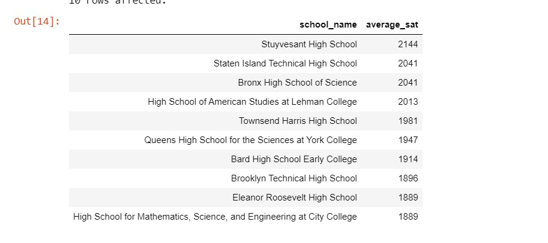

# Analyzing-NYC-Public-School-Test-Result-Scores

# Introduction
Every year, American high school students take SATs, which are standardized tests intended to measure literacy, numeracy, and writing skills. 
There are three sections - reading, math, and writing, each with a maximum score of 800 points. These tests are extremely important for students and colleges, 
as they play a pivotal role in the admissions process.
Analyzing the performance of schools is important for a variety of stakeholders, including policy and education professionals, researchers, 
government, and even parents considering which school their children should attend.

So, let's go!

# Inspecting the data
It is good practice to check the nature of the data, such as the total number of columns and rows. The result of the first query shows that the dataset has seven columns and three hundred seventy-five rows. The query was written to return only ten rows.

# Finding missing values
The query returned, when inspecting the dataset, shows that the school on the first row, "New Explorations into Science, Technology, and Math High School," has no data for the percentage_tested. The next step is to check if any of the schools have missing data for the percentage_tested column to understand whether this is a widespread missing data problem. The number of total schools in the database was calculated, and the ratio of the total percent_tested was determined. The query result showed that there are twenty schools whose percent_tested is missing, making up 5% of the total schools in the database.

# Schools by building code
Since there are twenty schools with missing data for the percent tested, the next step is to determine the total number of schools. While inspecting the data, several had the same value in the building_code column, indicating that there are multiple schools in the same location. The next step is to check for how many unique schools exist in each location. Query results showed a unique number of two hundred and thirty-three schools, which is only 62% of the total schools.

Moving on to the best schools in each category of the SATs.

# Best schools for math 
Here, we begin the analysis of the schools' performance. Since each school reports individually, they will be treated as such rather than being grouped by building_code. The query result was limited to ten to focus on the best ten schools that excel in math. We are aiming to identify all schools with an average math score of at least 80% (out of 800, the total score). Stuyvesant High School has the highest average math score of 754.

# Lowest reading score
Next, the focus shifts to identifying the lowest average reading score. The query results reveal that the lowest reading score is three hundred and two.

# Best writing school
Moving forward, the aim is to find the school with the highest average score. The query result identifies Stuyvesant High School with an average score of 693.

# Top 10 schools
Stuyvesant High School secures the highest writing and math scores. Let's explore other schools that demonstrate excellence across all subjects. The query result highlights Stuyvesant High School as the top-performing school with a total average score of two thousand hundred and forty-four across all subjects. In contrast, the High School for Mathematics, Science, and Engineering at City College is positioned at the bottom of the list with an average SAT score of a thousand eight hundred and eighty-nine.

# Ranking boroughs
Next is the analysis of the average SAT score per borough. The query result indicates that schools in Staten Island achieve higher scores across average math, average reading, and average writing.

# Brooklyn numbers
The earlier query revealed that schools in Staten Island achieve higher scores across all three categories. However, it's important to note that there are only ten schools in Staten Island, in contrast to an average of ninety-one schools in the other four boroughs. The result of the new query will specifically focus on these ten schools. The query result showed that Brooklyn Technical High School with an average score  of six hundred and eight two. 

# Conclusion
In conclusion, the analysis of NYC public school SAT scores uncovered important information. Stuyvesant High School is a star performer in math and writing. Staten Island generally has higher average scores, but we need to consider the number of schools in each area. Our findings stress the need to look at the big picture, including missing data and where schools are located. This insight can help parents, educators, and policymakers make informed decisions to improve education across the city.
